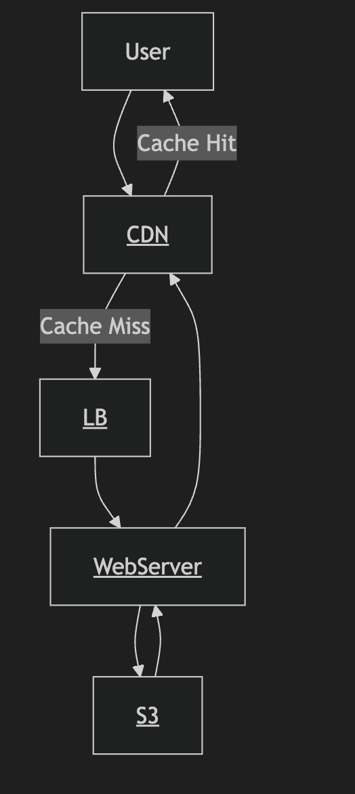

Steps:

1. Come up with some clarifying questions

### What is Spotify?

- **Songs/albums/artists**
- **Users**
- **Podcasts**

### Use Cases:

- Finding and playing music

2. Constrain the problem to make it solvable within the hour. Ask the use cases to focus on.
3. Share what you know about the system with the interviewer. This will help you get feedback and make sure you're on the right track.

Numbers:

- number of users: 1 billion
- number os songs: 100 million
- MP3 file size: 5MB
- 100 million songs \* 5MB = 500TB or 0.5PB
- 3x replication factor: 1.5PB for high availability storage
- 100B per song metadata: 10GB song metadata >> 100GB
- 1 KB per user metadata >> 1TB user metadata(1 billion user)
- How many songs does a user listen to in a day? 30 songs

1. Calculate the amount of data you'll be dealing with. This will help you understand the scale of the system.
2. Specify some key metrics to help your high level decision-making.
3. Lay out the basic components of your design.
4. Good dual bandwidth communication is important, so practice it. Make sure you're able to communicate your thoughts clearly and effectively.
5. Start with simple and high-level design and then drill down into the details.
6. Outline your database design.
7. Explain your decision making upfront

Brainstorming:
storage: song audio data, metadata(users, songs, artists, albums, playlists), user data

Why?

Songs Audio: S3, because these are immutable and just blob of data and they can't be changed. S3 is a good choice for storing large files and access pattern is just mostly reads and S3 is great for that. S3 is also highly available and durable.
Metadata: AWS RDS,

Songs Metadata:

- song_id
- song_name
- artist_id
- album_id
- song_length
- song_genre
- audio_file_path
- album_cover_path

8. Run through a use case: finding and playing music

- User searches a song which translates into a query to the metadata database
- The metadata database returns the song_id
- The song_id is used to fetch the audio file from S3
- The audio file is streamed to the user
- It will require to stream the audio file to the user which means we need a long running connection between the user and the server. We can use WebSockets for this.
- Or the size is just 5MB, it can be fetched into the web server memory and then streamed to the user. It would eliminate the lag of fetching the file from S3 every time.
- If a popular band release a song let's say Coldplay then all the webserver will be filled with that particular album song or one song.
- We can use a CDN to cache the popular songs and serve them from the edge location. It will reduce the load on the web server and also reduce the latency for the user.
- We can also use a cache like Redis to cache the metadata of the songs. It will reduce the load on the metadata database and also reduce the latency for the user.
- The first time the song is release, the server will read it and stream it like normal. Have a heatmap(played or requested/minute) and cache the popular songs.
- Now the request for the popular song will be served from the cache and the latency will be reduced.
  How does the CDN will work here?
- When a user requests a song, the request will first go to the CDN. The CDN will check if the song is available in the cache. If it is available then it will serve the song from the cache. If it is not available then it will fetch the song from the web server and cache it. The CDN will also cache the song in the edge location so that the next request for the same song will be served from the edge location.
- How the request will be routed from user to LB, to web server, to CDN, to S3?
- The user will first hit the Load Balancer. The Load Balancer will route the request to the web server. The web server will fetch the song from S3 and stream it to the user. The CDN will cache the song and serve it from the edge location.
- What if the same song is requested by multiple users? Does request will go through LB to CDN?
- The CDN will cache the song and serve it from the edge location. If the same song is requested by multiple users then the CDN will serve the song from the edge location. The request will not go through the Load Balancer.
- Who decides where to get the song from? CDN or LB?
- The CDN will decide where to get the song from. The CDN will check if the song is available in the cache. If it is available then it will serve the song from the cache. If it is not available then it will fetch the song from the web server and cache it. The CDN will also cache the song in the edge location so that the next request for the same song will be served from the edge location.
- So the first request wil go through CDN to LB to web server to S3?
- We can also do local store caching in the device of the user as well.
  

9. Talk through use case to check your design and identify bottlenecks.

10. How would you load balance the system?

The tasks are not a CPU intensive tasks, rather it's a network intensive tasks. So load balancing metrics should be based on network bandwidth. We can use round-robin or least connection algorithm for load balancing.

As we are caching in web server memory as well considering memory usage as well.

11. Refine your design

- geo aware data storage and retrieval
